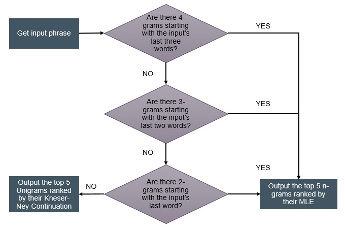

This application was developed for the Capstone Project for the Data Science Specialization in Coursera by Johns Hopkins University

#### How the word prediction is done
    
The Word Prediction app uses an [N-gram language model] (https://en.wikipedia.org/wiki/Language_model#n-gram_models) created from samples of twitter, blog and news text taken from a corpus called [HC Corpora] (http://www.corpora.heliohost.org/). The corpus text can be downloaded [here] (https://d396qusza40orc.cloudfront.net/dsscapstone/dataset/Coursera-SwiftKey.zip).

For this application, 4-gram, Trigram, Bigram and Unigram models are used along with an algorithm called [Stupid Back-Off] (http://www.aclweb.org/anthology/D07-1090.pdf) which is efficient for calculating predictions over huge datasets.

The decision tree for the algortihm can be found below.

 

In the interest of speed, the N-gram models have been pre-processed and resulting computations are saved into CSV files which the application reads in during initialization.

#### Additional documentation

Presentation slides fo this application may be found in: http://rpubs.com/ceathiel/wordprediction

Application code for this is available in github: 

1. Shiny Application code: https://github.com/Ceathiel/DataScienceCapstone/tree/master/WordPrediction
2. N-gram modelling codes: https://github.com/Ceathiel/DataScienceCapstone
