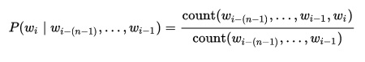

Word Prediction Application
========================================================
author: Moises Aaron Ruiz Garcia
date: February 2, 2021
font-family: arial
width: 1600
height: 900

This presentation will provide a quick background on the application, how to use it and how it works.

About the App
========================================================

The Word Prediction application provides next word suggestions given an input phrase. 

It was developed for the Capstone Project for the Data Science Specialization by Johns Hopkins University in Coursera.

The r codes for the application are available in the repository:

<https://github.com/MoisesAaron/DataScienceCapstone>

The r codes for generating the models used for prediction along with other materials created for the capstone project is available in the ff. repository:

<https://github.com/MoisesAaron/DataScienceCapstone>

***

Getting Started with Word Predictions
========================================================

The application has an input text field on the "Word Predictions" tab where you can type in. 

After the application loads in your browser, wait for the "App is ready" message to show up (about 10-20 seconds), then begin typing the phrase you want to get a prediction for. 

Your input phrase along with suggested next words will be shown below the textbox with about 1-2 seconds delay as you type.

***

<small>
Additional Notes:
* The application cannot provide predictions if you only input numbers or symbols. For example, "24 hours" is a valid input but "24" is not.
* Visitors may also refer to "Application Details" tab to get more information about the application
</small>

How It Works
========================================================

### Generating Next Word Suggestions

The Word Prediction app uses an [N-gram language model] (https://en.wikipedia.org/wiki/Language_model#n-gram_models) created from samples of twitter, blog and news text taken from a corpus called [HC Corpora] (http://www.corpora.heliohost.org/). The corpus text can be downloaded [here] (https://d396qusza40orc.cloudfront.net/dsscapstone/dataset/Coursera-SwiftKey.zip).

To generate the next word suggestions, the application uses an algorithm called [Stupid Back-Off] (http://www.aclweb.org/anthology/D07-1090.pdf) which is efficient for calculating predictions over huge datasets. 

The algorithm attempts to find a match on the highest order n-gram model available (4-gram for this app) and "backs off" to lower order models in case it doesn't find a match.

This allows us to provide next word suggestions even if we encounter an input phrase whose n-grams are not observed in the training text.

***

Algorithm Flowchart 

<small>
For the application, a 15% sample of the entire corpus was used for training the model. Using a laptop with 8 GB RAM and 2.10GHz CPU, it takes about 1.5 hrs to generate the entire model from reading in data, generating n-gram models and exporting them to csv files to be used by the application.
</small>

How It Works
========================================================

### Creating the Model

<small>
The 4-gram, Trigram, Bigram and Unigram models were created using the `dfm` function from [quanteda] (https://cran.r-project.org/web/packages/quanteda/vignettes/quickstart.html) package which provides capability for cleaning up text and extracting the unique n-grams along with their frequencies in the training corpus.

Once data has been cleaned up and we've extracted the count of occurence for unique n-grams found in the text, we compute the maximum likelihood estimate (MLE) for each n-gram using the ff. formula:

For Unigrams, Kneser-Ney Probability was also computed. As described in this [article] (http://smithamilli.com/blog/kneser-ney/), the unigram Kneser-Ney probability is the number of unique words the unigram follows divided by all bigrams.

***

Summary of Clean-up steps:

1. Changing text to lowercase
2. Removing non-ASCII characters
3. Removing punctuation and symbols (i.e. #, etc.)
4. Removing numbers
5. Removing sentences with words in the profanity list downloaded [here] (http://www.bannedwordlist.com/)

Additional Notes:
* Stemming and removal of stop words from the text was not done to retain the proper context when creating the n-grams.
* Addition of start and end of sentence markers was also skipped as the intent for the application is to be able to provide predictions even for shorter input phrases.
* The full code for model creation may be found in the [github repo] (https://github.com/Ceathiel/DataScienceCapstone/)
</small>

